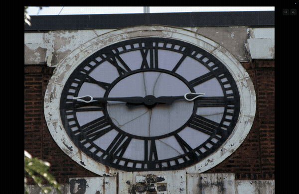

# The Clock Project — Screensaver

A macOS screensaver that tells time through photography, inspired by [theclockproject.com](https://www.theclockproject.com).

There are 1,440 minutes in a day. There is a photograph for each one.


*↑ 6× timelapse — [watch full demo](assets/demo-timelapse.mp4)*

---

## What it does

Instead of digits or hands, the current time is shown as a photograph — a clock face caught at exactly that angle, a street address that spells out the hour and minute, a shadow falling at just the right degree. Every minute, the image crossfades to the next.

Choose from four photographic styles, or combine any of them and the app alternates between your picks minute by minute.

| Style | What you see |
|---|---|
| **Clock Face** | Close-up photographs of analog clock faces |
| **Clock Wide** | Wide-angle scenes built around clocks |
| **Street Numbers** | House numbers and building addresses that form the time |
| **Angles** | Shadows, lines, and angles in the world that mirror clock hands |

Mix any combination — the app rotates through your chosen styles deterministically, so every minute always shows the same style regardless of restarts.

---

## Install

**Option 1 — DMG (recommended)**
1. Download `The.Clock.Project_0.1.0_aarch64.dmg` from [Releases](../../releases/latest)
2. Open the DMG, drag the app to Applications
3. Open the app — pick your style(s), hit Start

**Option 2 — Screensaver (system integration)**
1. Download `ClockProjectSaver.saver` from [Releases](../../releases/latest)
2. Double-click it — macOS asks "Install for me only?" → Install
3. Open System Settings → Screen Saver → select **The Clock Project**

> **First launch note**: macOS may warn *"app from unidentified developer"*. Right-click → Open → Open anyway. One-time prompt.

---

## How it works

Images are fetched directly from [theclockproject.com](https://www.theclockproject.com) and cached locally — the screensaver works fully offline after the initial download.

**Smart caching**: on first run the app immediately downloads the next 60 minutes of images so the screensaver is ready fast. The remaining 1,380 images download silently in the background at 8 parallel connections.

**Cache location:** `~/Library/Caches/theclockproject-saver/`

---

## Build from source

Prerequisites: [Rust](https://rustup.rs) · [Node.js v18+](https://nodejs.org) · macOS 11+

```bash
git clone https://github.com/tathagatmaitray/theclockproject-saver
cd theclockproject-saver
npm install
npm run dev        # dev with hot reload
npm run build      # produces .dmg + .app in src-tauri/target/release/bundle/
```

**Build the screensaver bundle:**
```bash
cd screensaver/mac
make               # builds ClockProjectSaver.saver
make install       # installs to ~/Library/Screen Savers/
```

---

## Architecture

```
┌─────────────────────────┐     ┌──────────────────────────┐
│   The Clock Project.app  │     │  ClockProjectSaver.saver  │
│                          │     │                           │
│  • Pick styles           │     │  • WKWebView display      │
│  • Download 1440 images  │────▶│  • Reads from shared cache│
│  • Cache to disk         │     │  • macOS idle integration │
└─────────────────────────┘     └──────────────────────────┘
    Run once to set up               Always on via macOS
```

---

## Tech stack

| Layer | Technology |
|---|---|
| Desktop framework | [Tauri 2](https://tauri.app) — Rust + WebView |
| Frontend | Vanilla JS + Vite (no framework) |
| Image fetching | Rust · `reqwest` · 8 concurrent downloads |
| Screensaver bundle | Swift · `ScreenSaver.framework` · `WKWebView` |
| Build | `cargo tauri build` → `.dmg` + `.app` |

---

## Credits

All photographs are from [The Clock Project](https://www.theclockproject.com). This app is an open-source client that fetches and displays their work. No images are redistributed — they are downloaded directly from their servers on first run.

---

## License

MIT — see [LICENSE](LICENSE)
